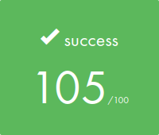
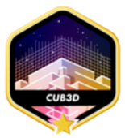
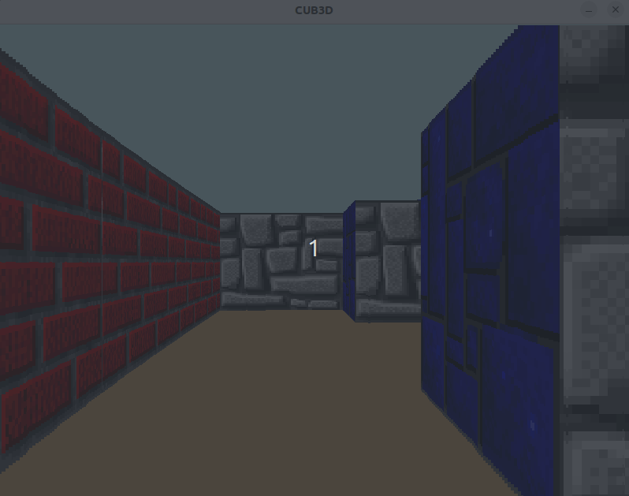
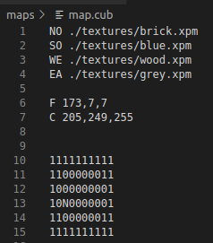
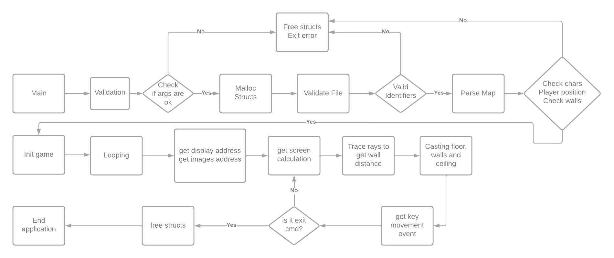

  
  

# 42_school_cub3d

This is the last project in C where we create a "3D" labyrinth  using the graphic interface minilibx library. In this project we dive in some math and discover how ray casting works.

## About

The program works with a file.cub as arg to open a 3D map so we can walk in during the game play. 

## Installation

<a href="https://harm-smits.github.io/42docs/libs/minilibx/getting_started.html#installation"> - Minilibx</a>

	in cmd line: make

The program should compile with all the necessary dependencies.

## How to run

To run the application it's necessary run the binary ./cub3D and a .cub file where is located in /maps/.
The screen game should open and you can walk around the map area.

## How to play

Move around the map using the keys "W, S, A, D, <-, ->".

## About .Cub file

You can create your own map editing the existing files or creating your own .cub file. The file must contain the info as the pattern below:

	Identifier: NO, SO, WE, EA 
		- path to the north, south, east, west texture images.
	Identifier: C, F
		- ceiling and floor R,G,B colors in range [0,255]: 0, 255, 255 
	The map is composed of 6 possible characters: 
		- 0 for an empty space,
		- 1 for a wall, 
		- N,S,E or W for the player’s start position and spawning orientation.
	

- You can use all the textures available in the textures folder, just include the property name in the file.
- You can add one start position only to map.
- The map must be surrounded by walls, so, you can use a " " anywhere on map as long as it surrounded by "1".

## Project fluxogram 

## References

<a href="https://harm-smits.github.io/42docs/libs/minilibx"> Minilibx </a> 

<a href="https://www.youtube.com/watch?v=gYRrGTC7GtA&t=14s"> 3DSage Channel - Make Your Own Raycaster Part 1</a>

<a href="https://www.youtube.com/watch?v=PC1RaETIx3Y"> 3DSage Channel - Make Your Own Raycaster Part 2</a>

<a href="https://www.youtube.com/watch?v=w0Bm4IA-Ii8&t=296s"> 3DSage Channel - Make Your Own Raycaster Part 3</a>

## 🤝 Contributors

The collab:

<table>
  <tr>
    <td>
      <a href="https://github.com/faustofaggion">
         
        <b>Fausto Faggion</b>
      </a>
    </td>
    <td>
      <a href="https://github.com/LacrouxRaoni">
         
        <b>Raoni Lacroux</b>
      </a>
    </td>

</table>
